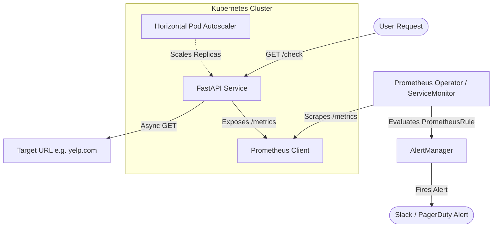

# Uptime Monitor

A production-grade, real-time uptime monitoring service designed to demonstrate mastery of Python (FastAPI), OpenTelemetry tracing, Prometheus metrics, AWS EKS infrastructure provisioning (via Terraform), and Kubernetes GitOps deployment.

---

## System Architecture



---

## Zero to Running in 5 Commands

Follow these five commands to provision, build, and deploy the entire solution:

```bash
# 1. Clone & Enter repository
git clone https://github.com/AryanYadav1010/Uptime-Monitor.git
cd Uptime-Monitor

# 2. Provision AWS VPC, EKS Cluster, and ECR Registry via Terraform
make deploy

# 3. Authenticate Docker, Build & Push image to ECR
make push

# 4. Trigger manual application check and verify endpoints
curl http://localhost:8000/check

# 5. Destroy all resources and clean up AWS billing footprint
make destroy
```

---

## Directory Structure & Guide

*   **`app/`**: Contains the FastAPI service.
    *   [`main.py`](file:///Users/aryanyadav/Desktop/yelp%20project/app/main.py): Sets up the FastAPI application, background loops, and configures OpenTelemetry instrumentation.
    *   [`checker.py`](file:///Users/aryanyadav/Desktop/yelp%20project/app/checker.py): Async checker executing non-blocking HTTP requests, injecting OTel spans/context propagation, and exporting JSON structured logs.
    *   [`metrics.py`](file:///Users/aryanyadav/Desktop/yelp%20project/app/metrics.py): Registers custom Prometheus metrics (`check_up`, `check_latency_seconds`).
    *   [`Dockerfile`](file:///Users/aryanyadav/Desktop/yelp%20project/app/Dockerfile): Secure multi-stage production build running as non-root user (UID 1000).
    *   [`requirements.txt`](file:///Users/aryanyadav/Desktop/yelp%20project/app/requirements.txt): Python dependency checklist.
*   **`infra/`**: Terraform configurations.
    *   [`main.tf`](file:///Users/aryanyadav/Desktop/yelp%20project/infra/main.tf): Provisioning script using official community-tested VPC and EKS modules.
    *   [`variables.tf`](file:///Users/aryanyadav/Desktop/yelp%20project/infra/variables.tf) / [`outputs.tf`](file:///Users/aryanyadav/Desktop/yelp%20project/infra/outputs.tf): Resource input definitions and outputs.
*   **`k8s/`**: Declarative Kubernetes manifests.
    *   [`deployment.yaml`](file:///Users/aryanyadav/Desktop/yelp%20project/k8s/deployment.yaml): Service deployment with resource constraints and health check probes.
    *   [`service.yaml`](file:///Users/aryanyadav/Desktop/yelp%20project/k8s/service.yaml): Configures ClusterIP and ServiceMonitor for auto-scraping.
    *   [`hpa.yaml`](file:///Users/aryanyadav/Desktop/yelp%20project/k8s/hpa.yaml): Dynamic replication rules.
    *   [`alert-rules.yaml`](file:///Users/aryanyadav/Desktop/yelp%20project/k8s/alert-rules.yaml): Custom alert definition (`PrometheusRule`) to alert on downstream targets.
*   **`.github/workflows/`**: Continuous Integration and Deployment.
    *   [`deploy.yml`](file:///Users/aryanyadav/Desktop/yelp%20project/.github/workflows/deploy.yml): Build, test, push, and deployment pipeline.

---

## Interview Ammunition (Design Decisions)

| Design Choice | Architectural Justification |
| :--- | :--- |
| **Multi-Stage Docker Build** | Separates build-time dependencies (compilers, build headers) from runtime resources, yielding lighter final image size and reducing security vulnerabilities. |
| **Horizontal Pod Autoscaler (HPA)** | Automatically scales replica count in response to actual traffic demands, securing application uptime and SLA compliance. |
| **PrometheusRule CRDs** | Treats alerting rules as declarative code resources, allowing alert policies to scale with developer self-service alongside standard Kubernetes manifests. |
| **OpenTelemetry (OTel)** | Unifies logs, metrics, and tracing into structured, trace-context-aware telemetry enabling deep analysis of distributed call paths over print logging. |
| **Terraform Modules** | Consumes standardized blueprints created by the community rather than raw resource configurations to prevent configuration errors. |
